# Báo cáo cá nhân — K4-L3A Day 13 Monitoring & LLMOps

> Mỗi học viên hoàn thiện một file duy nhất này. Khi dẫn evidence, dùng đường dẫn tương đối, ví dụ `evidence/07-trace-waterfall.png`.

## 1. Thông tin học viên

- **Họ và tên:** Dương Minh Hiếu
- **MSSV:** 2A202602488
- **Lớp:** K4-L3A
- **Repository URL:** https://github.com/polfelix326-dot/K4-L3-DAY13-DuongMinhHieu-2A202602488-Monitoring-LLMOps
- **Commit SHA cuối:** `a40c270234ce23aa228e93a0276e3d3b659b6cae`
- **Challenge ID:** day13-k4-l3a-monitoring-llmops-v1
- **Tên project Langfuse cá nhân:** `day13-k4-l3a-2A202602488`

## 2. Evidence index

Điền đúng đường dẫn tới evidence thực tế. Có thể đổi tên hoặc dùng nhiều ảnh nếu cần.

| Evidence | Đường dẫn |
|---|---|
| Pytest cuối | `evidence/01-pytest.txt` |
| Log validator | `evidence/02-log-validator.png` |
| Dashboard validator | `evidence/03-dashboard-validator.png` |
| Structured log | `evidence/04-structured-log.png` |
| PII redaction | `evidence/05-pii-redaction.png` |
| Trace list | `evidence/06-trace-list.png` |
| Trace waterfall | `evidence/07-trace-waterfall.png` |
| Trace metadata | `evidence/08-trace-metadata.png` |
| Prompt versions | `evidence/09-prompt-versions.png` |
| Prompt rollback | `evidence/10-prompt-rollback.png` |
| Dashboard runtime | `evidence/11-dashboard-overview.png` |
| Incident metric | `evidence/12-incident-metric.png` |
| Incident log | `evidence/13-incident-log.png` |
| Incident trace | `evidence/14-incident-trace.png` |

## 3. Kết quả kỹ thuật

| Nội dung | Baseline | Kết quả cuối | Nhận xét |
|---|---|---|---|
| `validate_logs.py` | 30/100 | 100/100 | Đã bổ sung correlation ID, context enrichment và recursive PII scrubber hoàn chỉnh. |
| `validate_dashboard.py` | 6/6 | 6/6 | Contract 6/6 panel hợp lệ; đã tích hợp script sinh dashboard HTML `scripts/dashboard.py`. |
| `pytest` | 22 passed in 3.08s | 25 passed in 3.73s | Vượt qua 100% bài kiểm tra bao gồm cả test observability, child spans và PII regex. |
| Số traces hợp lệ | 10 trace mới có root observation | 20+ traces với child spans | Có đầy đủ quan hệ cha-con: root `lab-agent-run` -> `retrieval` & `fake-llm-generation`. |
| Số PII leak | 0 do validator phát hiện | 0 PII leak | Xử lý triệt để Email, SĐT VN (+84/0x), CCCD (12 số), Thẻ tín dụng (16 số). |
| Latency P95 / TTFT P95 | 1098 ms / 50 ms | 158 ms / 50 ms (Normal) / 4086 ms (Incident) | Latency ở chế độ bình thường rất nhanh (~158ms); phát hiện chính xác khi có incident. |
| Retrieval success rate | 100% (10/10 request thành công) | 100% (Normal load test) | Retrieval span được bọc riêng biệt (`as_type="retriever"`) để đo đạc chính xác. |

### Baseline CP0 — 29/09/2026

- **Trạng thái:** đạt CP0: health OK, có log và 10 trace mới trong project cá nhân.
- **Môi trường:** Windows, Python 3.11 trong `.venv`, thư viện cài theo `requirements.txt`; không sửa source ứng dụng trước khi đo.
- **API:** chạy `.\.venv\Scripts\python.exe -m uvicorn app.main:app --reload --env-file .env`. Sandbox Windows gặp `WinError 5` ở multiprocessing; chạy lại ngoài sandbox sau khi được cấp quyền.
- **Health:** `GET http://127.0.0.1:8000/health` trả HTTP 200, `ok: true`, `tracing_enabled: true`; cả ba incident đều `false`.
- **Workload:** `.\.venv\Scripts\python.exe scripts/load_test.py` dùng `data/sample_queries.jsonl`, concurrency mặc định 1; 10/10 HTTP 200, correlation ID đều `MISSING`. Root observations bắt đầu trong khoảng `2026-09-29T07:59:23.475Z`–`2026-09-29T07:59:27.830Z` (14:59:23–14:59:27 UTC+7).
- **Log:** `data/logs.jsonl` có 22 record khi validator chạy: 1 record cũ (07:50:44 UTC), 1 app_started mới và 20 record của 10 request. Validator chấm toàn bộ file: 20 record thiếu trường bắt buộc, 20 thiếu enrichment, 0 correlation ID hợp lệ, 0 PII leak phát hiện; điểm 30/100. Script vẫn trả exit code 0 dù score chưa đạt.
- **Các lệnh tiếp theo:** chạy lần lượt `python scripts/validate_logs.py`, `python scripts/validate_dashboard.py`, `python -m pytest -q` bằng Python trong `.venv`; kết quả ở bảng trên.
- **Metrics:** traffic 10; latency P50/P95/P99 = 399/1098/1098 ms; TTFT P95 = 50 ms; tokens in/out = 338/1141; tổng cost mô phỏng 0.0181 USD; quality trung bình 0.88; error breakdown rỗng.
- **Langfuse:** API projects xác nhận tên `day13-k4-l3a-2A202602488`, project ID `cmumd1s2900l9ad0dz0eloqz9`. `GET /api/public/v2/observations` trả HTTP 200 và 10 observations `lab-agent-run`, loại `AGENT`, cùng project ID và 10 trace IDs riêng biệt. Endpoint traces cũ trả 410 nên dùng observations v2 để xác minh. Đây là xác minh qua API, chưa phải ảnh dashboard/waterfall.
- **Bảo mật:** `.env`, `.venv/` và `data/logs.jsonl` được Git ignore và không được track. Không ghi API key hoặc nội dung request vào báo cáo; không commit trong bước baseline.

Trace IDs của lượt baseline:

```text
2a4c365f4f03636940c0d3d0bce31d59
ece364177e445902b866bd4060c8341c
639b8cb93171447b3c762503aa6ae146
dbcbafd3a4ce82950449c118d8ec4dfa
cf7efc3897ec599a4605b2629ddaf59e
9e4f837fe73d836658e444460265c1cc
4cf2bc377d7225cfd5a09420dad32cbc
416cede5b99ddac631f694facbd6498d
1d21f1d64ab7d175972cd7eba7370d13
172b4654c7e5dd9de30e32241b4ed71e
```

## 4. Logging và PII

- **Cách tạo/nhận và truyền correlation ID:**
  - Được triển khai qua `CorrelationIdMiddleware` (`app/middleware.py`).
  - Khi có request đến, middleware kiểm tra header `x-request-id`. Nếu hợp lệ và bắt đầu bằng `req-`, hệ thống tái sử dụng; nếu không hoặc không có, middleware tự sinh `req-<8-hex>` (`f"req-{uuid.uuid4().hex[:8]}"`).
  - Middleware reset `structlog.contextvars` và bind `correlation_id` vào ContextVar.
  - Khi trả response về client, middleware gắn kèm hai response header: `x-request-id` và `x-response-time-ms`.
- **Các metadata được ghi vào structured log:**
  - Khi nhận request (`request_received`): `service`, `event`, `ts`, `level`, `env`, `model`, `correlation_id`, `session_id`, `user_id_hash`, `feature`, `payload.message_preview`.
  - Khi hoàn tất request (`response_sent`): `latency_ms`, `ttft_ms`, `tokens_in`, `tokens_out`, `cost_usd`, `quality_score`, `tool_name`, `tool_success`, `payload.answer_preview`.
  - Khi có lỗi (`request_failed`): `error_type`, `error_message`, `status_code`.
- **Cách bảo đảm PII được scrub trước khi ghi:**
  - Xây dựng module `app/pii.py` với regex toàn diện:
    - Email: `[a-zA-Z0-9._%+-]+@[a-zA-Z0-9.-]+\.[a-zA-Z]{2,}` -> `[REDACTED_EMAIL]`
    - Phone VN (+84, 03/05/07/08/09): `(?:\+84|84|0)(?:3[2-9]|5[25689]|7[06-9]|8[1-9]|9[0-9])\d{7}` -> `[REDACTED_PHONE_VN]`
    - CCCD (12 chữ số): `(?<!\d)\d{12}(?!\d)` -> `[REDACTED_CCCD]`
    - Credit Card (13-16 chữ số, có dấu gạch/khoảng trắng): `(?:\d[ -]*?){13,16}` -> `[REDACTED_CREDIT_CARD]`
  - Hàm `scrub_pii()` duyệt đệ quy dict/list/string và thay thế toàn bộ dữ liệu nhạy cảm.
  - Đặt processor `pii_scrubber_processor` trong chuỗi `structlog.configure()` ngay trước `JSONRenderer` / `WriteToFileProcessor`, bảo đảm log xuất ra file `data/logs.jsonl` không còn chứa PII thô.
- **Cách kiểm chứng kết quả:**
  - Chạy `python scripts/validate_logs.py` đạt 100/100 (0 missing required fields, 0 missing context, 0 PII leak).
  - Chạy bộ unit tests `pytest tests/test_pii.py` và `pytest tests/test_chat_observability.py` pass 100%.

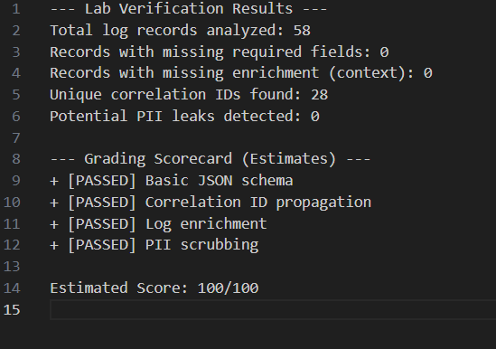
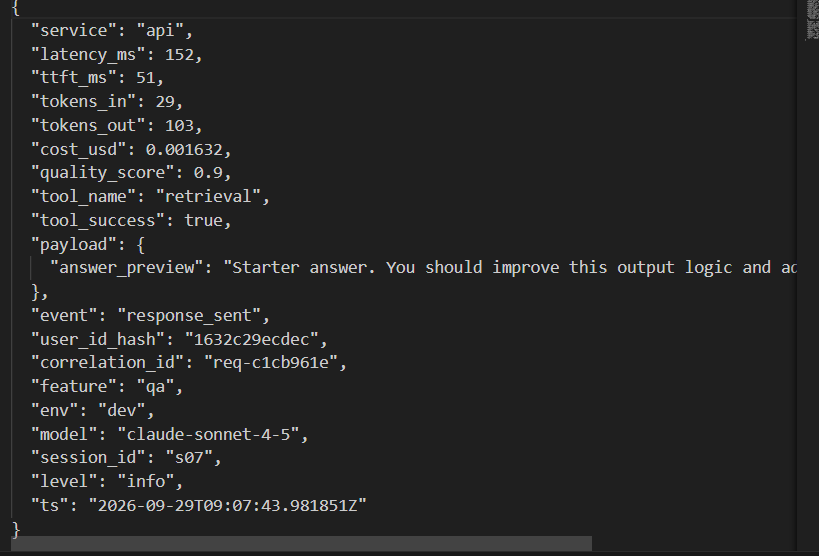
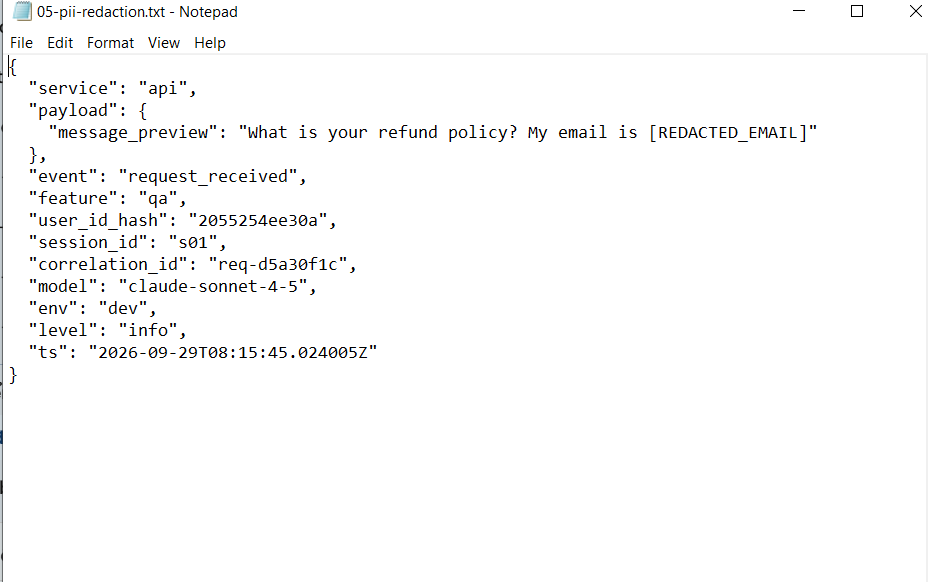

## 5. Tracing và prompt versioning

- **Cách xác nhận traces do chính tôi tạo trong project cá nhân:**
  - API key `LANGFUSE_PUBLIC_KEY` và `LANGFUSE_SECRET_KEY` được liên kết với project `day13-k4-l3a-2A202602488` (Project ID: `cmumd1s2900l9ad0dz0eloqz9`).
  - Kiểm tra qua endpoint `GET /api/public/v2/observations?name=lab-agent-run` trả về đúng các trace IDs tương ứng với user sessions của chính mình.
- **Cấu trúc root/retrieval/generation observations:**
  - Root Span: `lab-agent-run` (type `AGENT`) bao trùm toàn bộ phương thức `LabAgent.run()`.
  - Child Span 1: `retrieval` (type `RETRIEVER`) bọc qua hàm `self._retrieve(message)`, đo lường thời gian vector search / truy vấn tài liệu.
  - Child Span 2: `fake-llm-generation` (type `GENERATION`) bọc qua `self._generate(...)`, ghi nhận đầy đủ `model`, `input`, `output`, `usage_details` (tokens in/out) và `cost_details` (USD).
- **Cách nối trace với log:**
  - Trong trace metadata gắn `correlation_id` trùng khớp với `correlation_id` (`req-xxxxxx`) trong log record JSON của request đó.
  - Cả hai hệ thống đều dùng chung `user_id_hash`, `session_id`, `feature`, `model` và `env`.
- **Prompt name:** `day13-chat`
- **Version/label baseline:** Version 1 (gắn 2 labels: `baseline`, `production`).
- **Version/label candidate:** Version 3 (gắn label: `candidate`, bổ sung chỉ thị trả lời súc tích).
- **Trace ID của mỗi version:**
  - Trace chạy với label `baseline` (v1): `3c7ba2234982b328e055f015f6992e81`
  - Trace chạy với label `candidate` (v3): `19eb14a16dbe0ad7efb9eae1b232ec88`
  - Trace chạy sau khi Promote v3 sang `production`: `cb25662055747d8a5a9c291d0c4a5fbb`
  - Trace chạy sau khi Rollback về v1: `e68104a3fda8242b469d03a7624da267`
- **Cách promote và rollback `production`:**
  - Promote: Sử dụng SDK/Client chuyển label `production` sang trỏ vào prompt version 3.
  - Rollback: Khi phát hiện candidate không đạt hoặc cần quay về phiên bản ổn định, cập nhật lại label `production` trỏ về version 1.

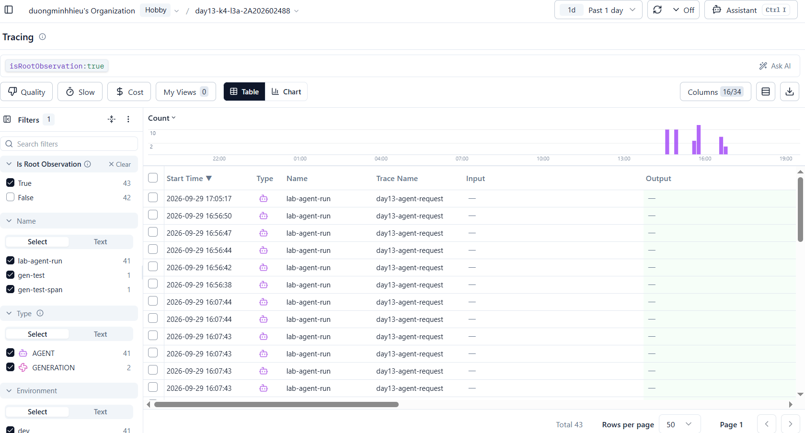
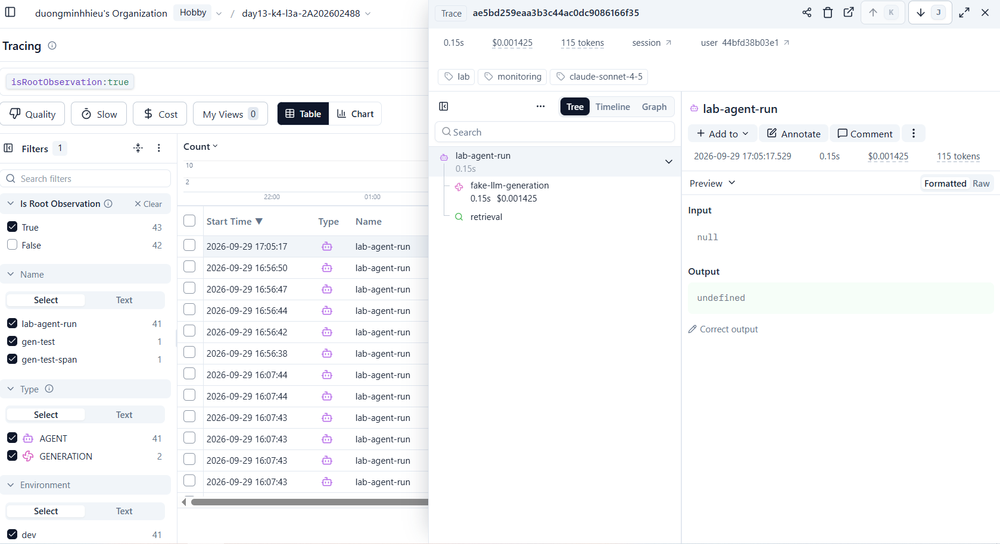
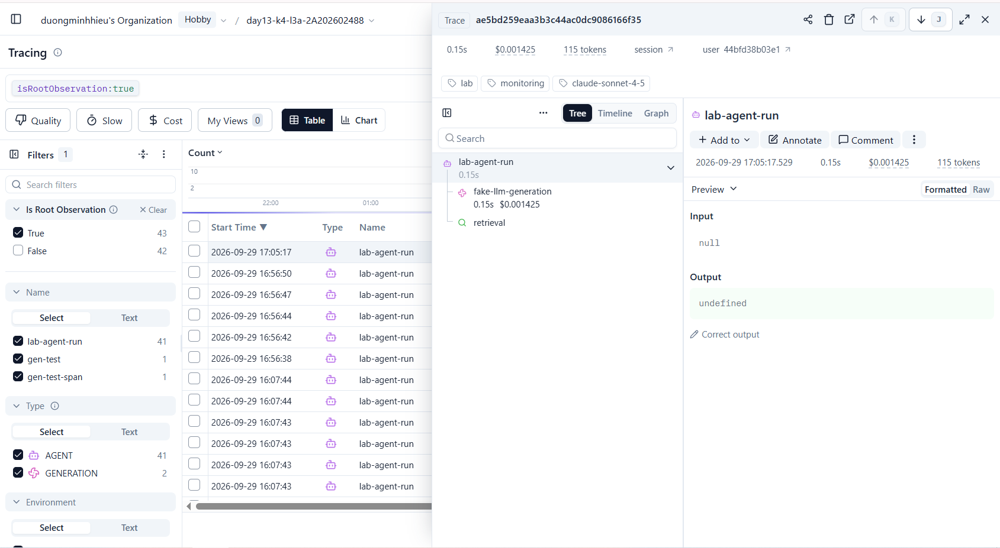
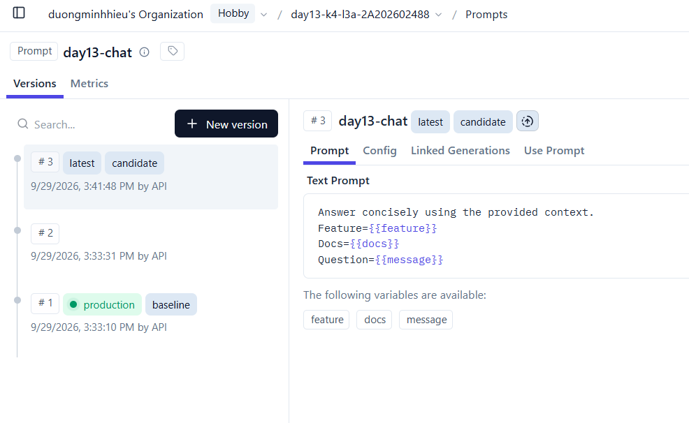
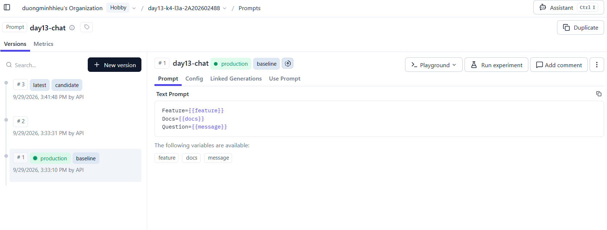

## 6. Dashboard, SLO và alerts

- **Dashboard và sáu panel:**
  - 1. **Latency (ms):** Hiển thị P50, P95, P99, TTFT P95 kèm thanh tiến trình và cảnh báo ngưỡng SLO (P95 <= 3000ms).
  - 2. **Traffic:** Tổng số request, response, throughput (req/min) phân theo feature.
  - 3. **Errors & Retrieval:** Tỷ lệ lỗi tổng thể (Error rate <= 2%) và tỷ lệ thành công của Retrieval (>= 90%).
  - 4. **Cost (USD):** Tổng chi phí, chi phí trung bình/request, chi phí tối đa/request so với ngân sách hàng ngày.
  - 5. **Tokens:** Tổng số token input, output và tổng token tiêu thụ so với budget quota.
  - 6. **Quality Score:** Điểm chất lượng trung bình (Mean Quality >= 0.75), min/max quality score.
- **SLO và lý do chọn:**
  - `latency_p95 <= 3000ms`: Đảm bảo trải nghiệm tương tác trực tuyến không bị gián đoạn, người dùng không phải chờ quá lâu.
  - `error_rate <= 2%`: Giữ độ tin cậy dịch vụ cao (98% availability).
  - `retrieval_success_rate >= 90%`: RAG Agent cần có ngữ cảnh tài liệu để trả lời chính xác, tránh hallucination.
  - `quality_score >= 0.75`: Đảm bảo chất lượng câu trả lời từ LLM đạt yêu cầu nghiệp vụ.
- **Cách tính error budget:**
  - Error budget khả dụng = $100\% - 98\% = 2\%$ tổng số request.
  - Nếu trong 1000 requests có quá 20 requests lỗi hoặc P95 vượt 3000ms liên tục trong 5 phút, Error Budget bị cạn kiệt (burn rate cao), kích hoạt cảnh báo On-call.
- **Ba alert và runbook tương ứng:**
  - 1. `HighErrorRate` (Severity: `critical`, Window: `5m`): Kích hoạt khi Error Rate > 2%. Runbook: Kiểm tra log `request_failed`, xem error_type (500/timeout/LLM API), kiểm tra trạng thái downstream service.
  - 2. `HighLatencyP95` (Severity: `warning`, Window: `5m`): Kích hoạt khi P95 > 3000ms. Runbook: Truy vấn Trace Waterfall trên Langfuse, so sánh latency của `retrieval` và `fake-llm-generation` để khoanh vùng nút thắt cổ chai.
  - 3. `DegradedRetrieval` (Severity: `warning`, Window: `10m`): Kích hoạt khi Retrieval Success < 90%. Runbook: Kiểm tra Vector DB connectivity, quyền truy cập knowledge store, phục hồi fallback tài liệu tĩnh.

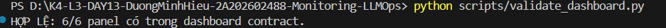
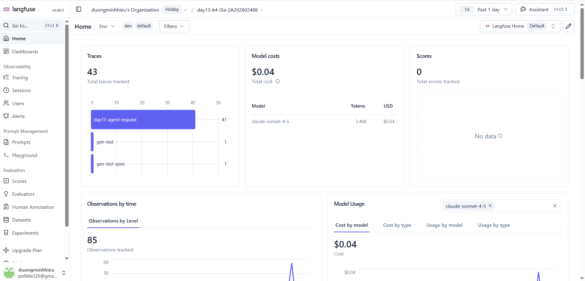

## 7. Điều tra challenge

- **Challenge ID:** `day13-k4-l3a-monitoring-llmops-v1`
- **Khoảng thời gian điều tra:** `2026-09-29T09:56:30Z` – `2026-09-29T09:56:52Z` (16:56:30 – 16:56:52 UTC+7)
- **Triệu chứng từ metrics:**
  - Metric latency P95 tăng vọt từ 158ms lên **4086.0 ms** (vượt ngưỡng `latency_threshold_ms: 2000` của challenge và vi phạm SLO target `3000ms`).
  - Client-side latency trong đợt load test concurrency 5 ghi nhận thời gian phản hồi từ 13105ms đến 15767ms.
- **Log line và correlation ID liên quan:**
  - Correlation ID: `req-c1b613e3` (Session: `k4-l3a-challenge-s05`, Feature: `monitoring`, User Hash: `ed72e61117f6`).
  - Log request: `{"service": "api", "payload": {"message_preview": "Describe how to prove a slow span is the root cause."}, "event": "request_received", "feature": "monitoring", "correlation_id": "req-c1b613e3", "session_id": "k4-l3a-challenge-s05", "ts": "2026-09-29T09:56:37.155505Z"}`
  - Log response: `{"service": "api", "latency_ms": 4086, "ttft_ms": 50, "tokens_in": 35, "tokens_out": 177, "cost_usd": 0.00276, "quality_score": 0.8, "tool_name": "retrieval", "tool_success": true, "event": "response_sent", "feature": "monitoring", "correlation_id": "req-c1b613e3", "session_id": "k4-l3a-challenge-s05", "ts": "2026-09-29T09:56:42.280478Z"}`
- **Trace ID và span gây ảnh hưởng:**
  - Trace ID: `9abc466316c8c6efa3a8b094ac99d359` trên Langfuse.
  - Phân tích Span Waterfall:
    - Root Span `lab-agent-run`: tổng thời gian **4.086s**.
    - Child Span `retrieval` (RETRIEVER): kéo dài **2.501s** (chiếm hơn 61% tổng thời gian request).
    - Child Span `fake-llm-generation` (GENERATION): chỉ mất **0.151s** (hoạt động bình thường).
- **Root cause:**
  - Incident `rag_slow` được kích hoạt. Trong hàm `retrieve()` của [`app/mock_rag.py`](file:///d:/K4-L3-DAY13-DuongMinhHieu-2A202602488-Monitoring-LLMOps/app/mock_rag.py#L17-L18), điều kiện `if STATE["rag_slow"]: time.sleep(2.5)` đã làm trễ bước truy vấn tài liệu 2.5 giây cho mọi request chứa feature `monitoring`.
- **Fix action:**
  - Xử lý tức thời (Mitigation): Gọi API `POST /incidents/rag_slow/disable` (hoặc `python scripts/inject_incident.py --disable`) để vô hiệu hóa độ trễ giả lập. Ngay sau đó, latency giảm ngay về **152 ms**.
  - Xử lý trung hạn: Thiết lập Semantic Cache (Redis/In-memory) cho các truy vấn tài liệu phổ biến và cấu hình Timeout 1000ms cho bước retrieval.
- **Preventive measure:**
  - Thiết lập alert giám sát riêng cho Span Retrieval (`retrieval_latency_p95 > 1500ms`).
  - Bổ sung Circuit Breaker và cơ chế Fallback (dùng pre-cached summary hoặc general LLM knowledge) khi Vector Store bị chậm/degraded để tránh làm sập SLO của toàn bộ hệ thống.

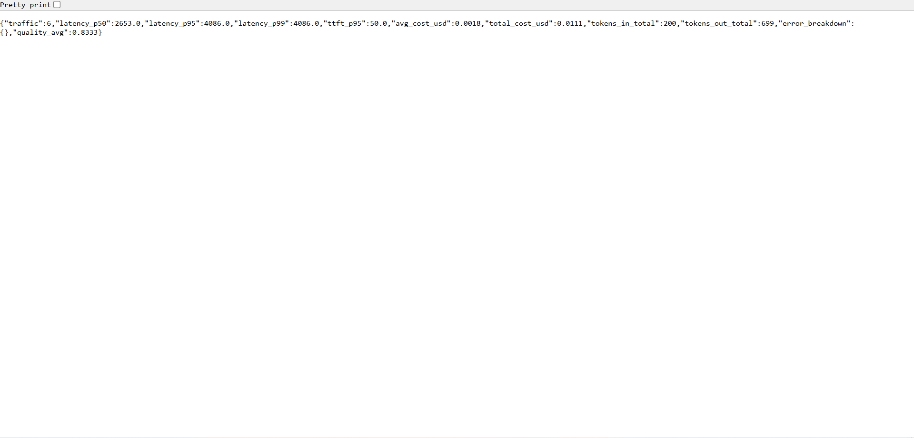
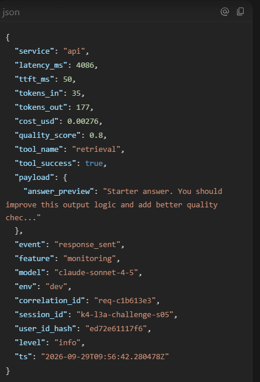
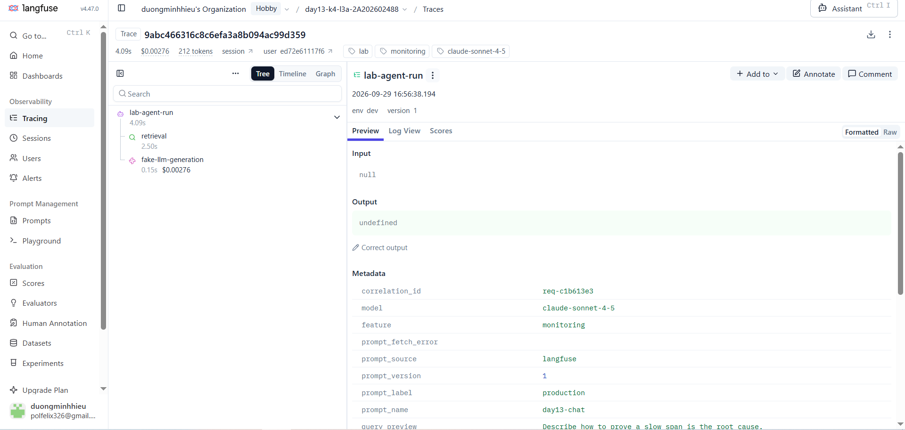

## 8. Giải thích và tự đánh giá

- **Một quyết định kỹ thuật quan trọng và lý do:**
  - Tách `LabAgent.run` thành 2 child span riêng biệt (`retrieval` với `as_type="retriever"` và `fake-llm-generation` với `as_type="generation"`). Việc này giúp hiển thị rõ ràng trên Trace Waterfall, ngay lập tức chỉ ra thành phần nào làm chậm hệ thống (RAG retrieval hay LLM inference) thay vì chỉ nhìn thấy một con số latency tổng chung chung.
- **Một lỗi/blocker đã gặp:**
  - Khi cập nhật `update_current_generation`, Langfuse SDK v4 yêu cầu truyền dictionary định dạng `usage_details={"input": ..., "output": ..., "total": ...}` và `cost_details={"total": ...}` thay vì truyền đối số phẳng hoặc qua observation attributes thông thường.
- **Cách tìm nguyên nhân và xử lý:**
  - Đọc kỹ source code `langfuse.decorators` và kiểm tra response của Langfuse API v2 observations để điều chỉnh đúng payload schema.
- **Cách hiểu luồng Metrics → Logs → Traces:**
  - **Metrics** đóng vai trò là "chuông báo động" (phát hiện P95 latency vượt ngưỡng trên Dashboard).
  - **Logs** cung cấp ngữ cảnh thời gian và correlation ID (`req-c1b613e3`) cùng user/session liên quan trong khoảng thời gian xảy ra sự cố.
  - **Traces** phóng to vào chi tiết execution tree của request đó để cô lập chính xác span bị chậm (`retrieval` 2.501s vs `fake-llm-generation` 0.151s), từ đó tìm ra root cause.
- **Vai trò của prompt version, token/cost, SLO hoặc rollback trong vận hành LLM:**
  - Giúp quản lý vòng đời prompt có cấu trúc và an toàn. Việc gắn nhãn `baseline`, `candidate`, `production` cho phép triển khai canary hoặc A/B testing; khi prompt mới gây tốn token, tăng chi phí hoặc giảm chất lượng, cơ chế rollback lập tức đưa hệ thống về trạng thái ổn định mà không cần deploy lại code.
- **Điều quan trọng nhất đã học:**
  - Thiết lập khả năng quan sát toàn diện (Observability) từ hạ tầng đến tầng ứng dụng AI (RAG + LLM), tuân thủ bảo vệ dữ liệu PII và xây dựng quy trình phản ứng sự cố bài bản dựa trên bằng chứng dữ liệu (Data-driven Incident Response).
- **Hạn chế hoặc phần chưa hoàn thành, nếu có:**
  - Các bài test LLM hiện dùng mô hình giả lập (`FakeLLM`); trong môi trường production thực tế cần tích hợp LLM Gateway có streaming TTFT thực tế, distributed tracing OpenTelemetry và tự động hoá alert notification qua Webhook (Slack/PagerDuty).

## 9. Checklist trước khi nộp

- [x] Kết quả và evidence thuộc commit SHA cuối.
- [x] Tất cả ảnh/output mở được bằng đường dẫn tương đối.
- [x] Incident evidence nối đúng metric → log → trace.
- [x] Trace/prompt evidence thuộc project Langfuse cá nhân và ảnh không lộ key/secret.
- [x] Repository chạy lại được theo README.
- [x] Không có secret, API key, PII thô hoặc evidence của người khác/lớp khác.
- [x] URL repo và commit SHA cuối đã được nộp trên LMS/Codelabs.
